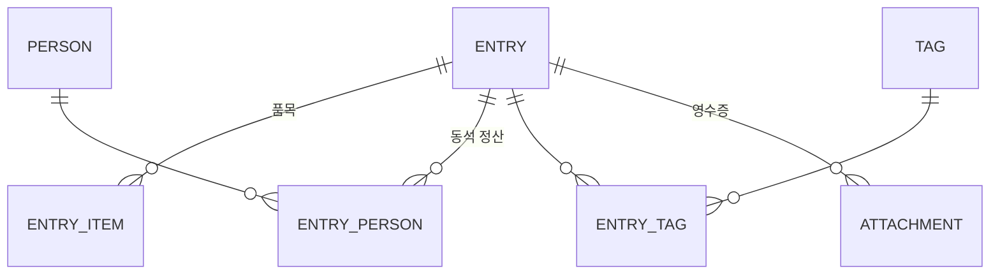
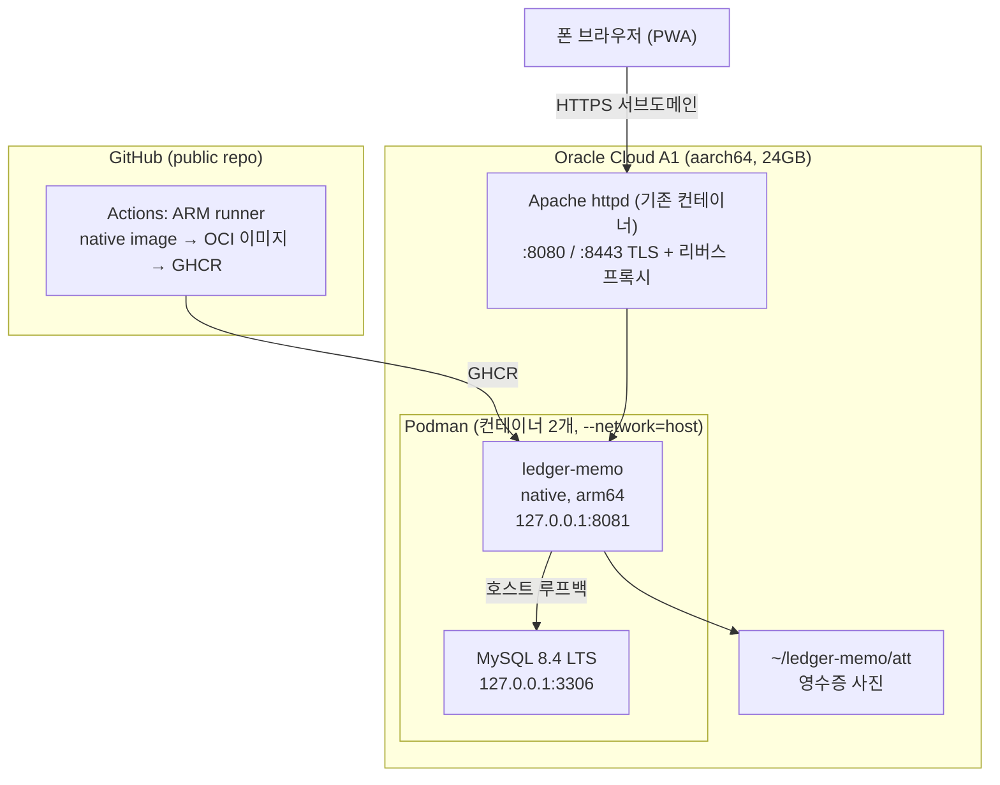

# ledger-memo 설계

가계부 분개 전 단계의 거래 초안을 폰에서 즉석 기록하는 개인용 웹서비스.

기존에는 Google Keep 체크리스트("분개 TODO")에 자유 텍스트로 적어왔다. 분개장 작성이 밀리면
(실제로 2개월 밀린 사례) 메모가 길어지고, 당시 상세히 적기 귀찮았던 항목은 나중에 복원이
불가능해진다. 이 서비스는 **Keep 과 같은 입력 속도를 유지하면서 데이터를 구조화**해 그 문제를
없앤다.

- 사용자: 1명 (개인용)
- 수집 대상: 자동 수집이 불가능한 정보 (비용 카테고리, 결제수단 분리, 동석자 정산, 품목 상세)
- 관련 프로젝트: [`ledger-scripts`](../ledger-scripts) (거래 raw 자동 수집 + 분개 변환)

## 1. 설계 원칙

### 1.1 입력 마찰을 Keep 수준으로 유지 (최우선)

구조화 폼의 전형적 실패는 필드가 많아 술집/택시에서 안 쓰게 되고 Keep 으로 회귀하는 것이다.
Keep 을 오래 쓴 이유가 "입력창 하나에 그냥 타이핑"이므로 이 성질을 반드시 보존한다.

- **필수 입력은 한 줄 텍스트 또는 사진 한 장.** 그 외 모든 필드는 optional.
- 파싱 결과는 칩(chip)으로 보여주고 탭해서 수정한다. 폼을 채우게 하지 않는다.
- 카테고리/결제수단은 나중에 보강하거나 끝까지 비워도 된다. 비어 있어도 Keep 보다 낫다.

### 1.2 원문은 절대 버리지 않는다

`entry.raw_text` 에 입력 원문을 항상 보존한다.

- 파싱이 틀려도 정보 유실이 없다.
- 파서 규칙을 개선한 뒤 재파싱할 수 있다.
- `5/29 Google One 있었을 듯, 그 전에 잔액 충전도` 처럼 **구조화가 불가능한 메모도 그대로
  받는다** (파싱 결과가 비어도 저장 성공). Keep 의 자유도를 잃지 않기 위한 장치다.

### 1.3 사진만으로도 유효한 기록

영수증을 찍는 것이 "당시 상세히 적기 귀찮았던" 문제의 가장 직접적인 해법이다. 따라서
`raw_text` 없이 첨부만 있는 entry 도 유효하다 (촬영 2탭으로 기록 완료).

- 앱 레벨 검증: `raw_text` 와 첨부 중 **최소 하나**는 있어야 한다.
- EXIF 촬영 시각으로 날짜/시각을 자동 채운다.

### 1.4 서버는 이미지 처리를 하지 않는다

리사이즈/썸네일 생성은 전부 클라이언트(Canvas)에서 한다.

- 서버 메모리 스파이크 제거.
- native image 에서 문제가 되는 `ImageIO` 의존을 아예 만들지 않는다.

## 2. 한 줄 파서 명세

파싱은 **서버(Kotlin)에 단일 구현**한다. 클라이언트는 타이핑 중 debounce 300ms 로
`POST /api/parse` 를 호출해 미리보기만 받는다. 오프라인일 때는 원문만 큐에 넣고, 온라인
복귀 시 서버가 파싱한다. 규칙이 한 곳에만 존재해 클라이언트/서버 로직 중복이 없다.

### 2.1 금액 표기

실제 Keep 메모에서 역산한 규칙이다. **소수점 표기는 만원 단위**다.

| 표기 | 해석 | 실제 예 |
|---|---|---|
| `4.5` `2.3` `0.2` | 만원 단위 (x 10,000) | `2인세트 4.5` = 45,000 |
| `3만` `3만원` | 만원 단위 | `모바일선물 3만원 등록` |
| `8100` (3자리 이상 정수) | 원 단위 | `택시 8100` = 8,100 |
| `1100x2` `1100*2` | 단가 x 수량 | `아이시스500ML 1100x2` = 2,200 |
| 품목명 끝 숫자 (`소주2`) | 수량 (금액 아님) | `소주2 1.0` = 소주 2병 10,000 |

검증 예:
```
원조해장촌 2인세트 4.5 소주2 1.0 맥주3 1.5
  = 45,000 + 10,000 + 15,000 = 70,000   (2인 술자리로 정합)
싸리골 해물파전2.3 지평2 1.0 콜라 0.2?
  = 23,000 + 10,000 + 2,000 = 35,000
```

`total_amount` 는 품목 금액의 합. 금액이 하나뿐이면 그 값.

### 2.2 그 외 토큰

| 대상 | 규칙 | 예 |
|---|---|---|
| 날짜 | `M/D` 형태. 없으면 오늘 | `5/31` |
| 시각 | **콜론이 있는 것만** (`21:37`). 없으면 입력 시각 | `2137` 은 금액과 구분 불가하므로 시각으로 보지 않는다 |
| 장소 | 첫 금액 이전의 선두 토큰 | `원조해장촌` |
| 품목 | `품목[수량] 금액` 패턴 반복 | `2인세트 4.5` |
| 사람 | `person` 테이블의 name/aliases 사전 매칭 | `박채원`, `정민` |
| 인원수 | `N명` (사람 사전에 없을 때) | `택시 8100 3명` |
| 태그 | `#태그` 또는 키워드 사전 (`회사`, `가족`) | `라이카 통해서 회사` |
| 불확실 | `?` 포함 시 `uncertain = true` | `콜라 0.2?` |

### 2.3 파서의 위치

파서는 **반복 개선 대상**이다. 품목명에 숫자가 붙는 경우(`아이시스500ML`)처럼 오인 가능한
입력이 계속 나오므로 완벽을 목표하지 않는다. 1.2 의 원문 보존과 칩 수정 UI 가 안전망이므로,
파서는 "대부분 맞으면 이득" 수준으로 두고 규칙을 점진적으로 늘린다.

## 3. 데이터 모델

`entry` 를 aggregate root 로, 나머지가 딸린 구조다.



### 3.1 DDL (MySQL 8.4)

```sql
CREATE DATABASE ledger_memo
    DEFAULT CHARACTER SET utf8mb4
    DEFAULT COLLATE utf8mb4_0900_ai_ci;

CREATE TABLE ledger_memo.entry (
    id            BIGINT       NOT NULL AUTO_INCREMENT,
    occurred_on   DATE         NOT NULL,
    occurred_at   TIME         NULL,
    raw_text      TEXT         NULL,
    place         VARCHAR(200) NULL,
    total_amount  INT          NULL,
    category_hint VARCHAR(100) NULL,
    payment_hint  VARCHAR(100) NULL,
    headcount     INT          NULL,
    uncertain     BOOLEAN      NOT NULL DEFAULT FALSE,
    memo          TEXT         NULL,
    status        VARCHAR(10)  CHARACTER SET ascii COLLATE ascii_bin NOT NULL DEFAULT 'OPEN',
    done_at       DATETIME(6)  NULL,
    created_at    DATETIME(6)  NOT NULL,
    updated_at    DATETIME(6)  NOT NULL,
    PRIMARY KEY (id),
    KEY idx_status_occurred_on_occurred_at (status, occurred_on, occurred_at),
    KEY idx_occurred_on_occurred_at (occurred_on, occurred_at)
) ENGINE = InnoDB;

CREATE TABLE ledger_memo.entry_item (
    id         BIGINT       NOT NULL AUTO_INCREMENT,
    entry_id   BIGINT       NOT NULL,
    seq        INT          NOT NULL,
    name       VARCHAR(200) NOT NULL,
    qty        INT          NULL,
    unit_price INT          NULL,
    amount     INT          NULL,
    PRIMARY KEY (id),
    KEY idx_entry_id_seq (entry_id, seq),
    CONSTRAINT fk_entry_item_entry FOREIGN KEY (entry_id)
        REFERENCES ledger_memo.entry (id) ON DELETE CASCADE
) ENGINE = InnoDB;

CREATE TABLE ledger_memo.person (
    id      BIGINT       NOT NULL AUTO_INCREMENT,
    name    VARCHAR(100) NOT NULL,
    aliases VARCHAR(500) NULL,
    active  BOOLEAN      NOT NULL DEFAULT TRUE,
    PRIMARY KEY (id),
    UNIQUE KEY uk_name (name)
) ENGINE = InnoDB;

CREATE TABLE ledger_memo.entry_person (
    id           BIGINT      NOT NULL AUTO_INCREMENT,
    entry_id     BIGINT      NOT NULL,
    person_id    BIGINT      NOT NULL,
    role         VARCHAR(20) CHARACTER SET ascii COLLATE ascii_bin NOT NULL,
    share_amount INT         NULL,
    settled      BOOLEAN     NOT NULL DEFAULT FALSE,
    PRIMARY KEY (id),
    KEY idx_entry_id (entry_id),
    KEY idx_person_id_settled (person_id, settled),
    CONSTRAINT fk_entry_person_entry FOREIGN KEY (entry_id)
        REFERENCES ledger_memo.entry (id) ON DELETE CASCADE,
    CONSTRAINT fk_entry_person_person FOREIGN KEY (person_id)
        REFERENCES ledger_memo.person (id)
) ENGINE = InnoDB;

CREATE TABLE ledger_memo.tag (
    id   BIGINT       NOT NULL AUTO_INCREMENT,
    name VARCHAR(100) NOT NULL,
    PRIMARY KEY (id),
    UNIQUE KEY uk_name (name)
) ENGINE = InnoDB;

CREATE TABLE ledger_memo.entry_tag (
    entry_id BIGINT NOT NULL,
    tag_id   BIGINT NOT NULL,
    PRIMARY KEY (entry_id, tag_id),
    KEY idx_tag_id (tag_id),
    CONSTRAINT fk_entry_tag_entry FOREIGN KEY (entry_id)
        REFERENCES ledger_memo.entry (id) ON DELETE CASCADE,
    CONSTRAINT fk_entry_tag_tag FOREIGN KEY (tag_id)
        REFERENCES ledger_memo.tag (id)
) ENGINE = InnoDB;

CREATE TABLE ledger_memo.attachment (
    id           BIGINT       NOT NULL AUTO_INCREMENT,
    entry_id     BIGINT       NOT NULL,
    file_path    VARCHAR(300) NOT NULL,
    thumb_path   VARCHAR(300) NULL,
    content_type VARCHAR(50)  CHARACTER SET ascii COLLATE ascii_bin NOT NULL,
    bytes        INT          NOT NULL,
    shot_at      DATETIME(6)  NULL,
    created_at   DATETIME(6)  NOT NULL,
    PRIMARY KEY (id),
    KEY idx_entry_id (entry_id),
    CONSTRAINT fk_attachment_entry FOREIGN KEY (entry_id)
        REFERENCES ledger_memo.entry (id) ON DELETE CASCADE
) ENGINE = InnoDB;
```

`status` 는 `OPEN` / `DONE`, `entry_person.role` 은 `COMPANION` / `PAID_FOR` / `OWES_ME`.
둘 다 애플리케이션 enum 에 매핑되는 ASCII 고정 토큰이라 `ascii_bin` 으로 선언한다.

### 3.2 설계 의도

- **`occurred_on` / `occurred_at` / `total_amount` 를 정규 컬럼으로 둔다.** 현재 스코프에서는
  정렬/검색용이지만, 이 세 값이 `ledger-scripts` collector 들의 본 가계부 매칭 키
  (`날짜, 시각(분), |금액|`)와 동일하다. 나중에 임시 시트 placeholder 자동 보강으로 스코프를
  넓히더라도 스키마 변경 없이 붙는다.
- **`person` 을 마스터 테이블로 분리**한 이유는 두 가지다. 파서의 이름 사전이면서, 사람별
  미정산 조회의 기준이 된다. 본 가계부에 `채권: 양진혁 5/23 통행료` 처럼 사람 단위 채권이
  실제로 쌓이고 있어 바로 쓸 수 있는 기능이 된다.
- **`category_hint` / `payment_hint` 는 마스터 없이 문자열**로 둔다. 분개장의 계정 체계
  (비용 29종 + 이벤트성 계정)를 이 서비스에 복제하면 양쪽 동기화 부담이 생기고, 현재
  스코프에서는 힌트 문자열로 충분하다.
- **첨부 파일은 파일시스템, DB 에는 메타데이터만.** BLOB 은 백업과 메모리 양쪽에서 불리하다.
  경로 규칙은 `{root}/{yyyy}/{MM}/{uuid}.jpg` + `{uuid}_thumb.jpg`.

## 4. API

| Method | Path | 용도 |
|---|---|---|
| `POST` | `/api/parse` | 한 줄 텍스트 파싱 미리보기 (저장하지 않음) |
| `POST` | `/api/entries` | 생성 (raw_text 및/또는 첨부) |
| `GET` | `/api/entries` | 목록. `status` / `from` / `to` / `q` / `personId` 필터 |
| `GET` | `/api/entries/{id}` | 단건 (자식 포함) |
| `PATCH` | `/api/entries/{id}` | 부분 수정 (칩 수정, 보강) |
| `POST` | `/api/entries/{id}/reparse` | 원문 재파싱 (파서 개선 후 소급 적용) |
| `PUT` | `/api/entries/{id}/status` | `OPEN` / `DONE` 전환 |
| `DELETE` | `/api/entries/{id}` | 삭제 |
| `POST` | `/api/entries/{id}/attachments` | 사진 업로드 (multipart) |
| `GET` | `/api/attachments/{id}` | 원본. `?thumb=true` 로 썸네일 |
| `POST` | `/api/entries/bulk` | 여러 줄 일괄 등록 (Keep 미완료분 이관) |
| `GET` | `/api/hints` | 카테고리/결제수단/태그 자동완성 후보 |
| `GET` | `/api/persons` · `POST` | 사람 마스터 |
| `GET` | `/api/settlements` | 사람별 미정산 합계 |
| `POST` | `/api/entries/{id}/persons` | 거래에 사람 추가 |
| `PATCH` | `/api/entry-persons/{id}` | 역할/분담액/정산 부분 수정 |
| `PUT` | `/api/entry-persons/{id}/settled` | 정산 완료 표시 |
| `DELETE` | `/api/entry-persons/{id}` | 거래에서 사람 제거 |

일괄 등록은 **줄 단위로 독립 처리**한다. 한 줄이 실패해도 나머지를 저장하고 실패한 원문을
돌려준다. 수백 줄을 붙여넣었을 때 한 줄 때문에 전부 되돌리는 편이 더 나쁘다.

`PATCH /api/entries/{id}` 의 문자열 필드는 **빈 문자열을 "지움"으로 받는다.** 필드를 보내지
않은 것(null)과 화면에서 비운 것("")을 구분해야 상세 화면에서 장소나 메모를 지울 수 있다.

멀티파트는 힙을 거치지 않고 디스크로 직행시킨다:
`spring.servlet.multipart.file-size-threshold=0`, `max-file-size=8MB`.

## 5. 화면 (4개)

| 화면 | 내용 |
|---|---|
| **작성** (기본) | 한 줄 입력 + 촬영 버튼 + 파싱 칩 + 저장. 최근 저장 3건. 사용의 90% 지점 |
| **목록** | `OPEN` 기본, 날짜 그룹핑. 탭으로 완료 처리. 검색(장소/품목/금액) |
| **상세/보강** | 품목 편집, 카테고리/결제수단/메모, 사진 추가, 사람·정산, 원문 재파싱 |
| **정산** | 사람별 미정산 합계. 분개장 채권/채무 입력 시 참조 |
| **임포트** | 여러 줄 붙여넣기 → 일괄 등록. 실패한 줄만 입력창에 남는다 |

상세는 목록/최근 카드를 탭하면 열리는 바텀 시트다. 탭을 늘리지 않고 목록 흐름에서 바로
보강할 수 있게 했다.

프론트는 빌드 없는 단일 HTML + vanilla JS. 화면 4개에 번들러를 도입할 이유가 없다.
PWA manifest 로 홈 화면에 설치하고, 오프라인 입력은 `localStorage` 큐에 넣어 온라인 복귀 시
flush 한다 (지하 술집/지하철에서 입력이 날아가지 않게).

분개 작업 시에는 목록에서 날짜 범위를 좁혀 PC 로 보면서 임시 시트를 채운다. Keep 과 달리
완료분은 기본 숨김 + 검색 가능이다.

## 6. 인증

단일 사용자 자체 로그인.

- 비밀번호는 **Argon2id 해시**를 환경변수로 주입. 평문과 해시 모두 repo 에 두지 않는다.
- **remember-me 토큰 1년** (DB persistent token) — 폰에서 사실상 재로그인이 없다.
- 로그인 실패 rate limit (IP + 계정 카운터, 5회 초과 시 지연). 무차별 시도 차단은 앞단 httpd
  에서도 병행한다 (fail2ban 또는 `mod_evasive`).
- 세션은 in-memory (단일 사용자라 외부 세션 저장소 불필요).

## 7. 인프라



A1 단일 호스트, **Podman** 컨테이너 2개. **Compose 도 Quadlet 도 쓰지 않고 `podman run` 으로
각각 실행한다.**

- **앞단**: 기존 Apache httpd 컨테이너에 서브도메인 VirtualHost 추가 (Caddy 도입 없음).
- **앱/DB**: `podman run` 2회. 오케스트레이션 계층을 두지 않는다.
- **네트워크는 `--network=host`**: 서버의 기존 컨테이너(httpd, php-fpm)가 이미 이 방식이라
  맞춘다. 사용자 정의 네트워크의 이름 기반 DNS(aardvark-dns)에 의존하지 않아 구성이 단순하고,
  httpd 가 같은 네임스페이스에서 `127.0.0.1:8081` 로 바로 프록시한다.
- **외부 노출은 바인딩 주소로 막는다**: host 네트워크에는 publish 개념이 없으므로 MySQL 은
  `--bind-address=127.0.0.1`, 앱은 `SERVER_ADDRESS=127.0.0.1` 로 루프백에만 리슨시킨다.
- **첨부**: 호스트 디렉토리 `~/ledger-memo/att` 를 볼륨 마운트 (컨테이너 교체와 무관하게
  파일이 남아야 한다).

호스트 포트 배치 — 이 서버는 rootless 라 httpd 가 80/443 을 직접 쓰지 못하고, firewalld 가
80/443 을 8080/8443 으로 포워딩한다.

| 포트 | 용도 |
|---|---|
| 8080 / 8443 | 기존 httpd (firewalld 가 80/443 에서 포워딩) |
| 8081 | ledger-memo (루프백 전용) |
| 3306 | MySQL (루프백 전용) |

### 7.1 필수 제약

- **native image 는 크로스 컴파일이 불가능하다.** A1 이 aarch64 이므로 CI 도 ARM runner 여야
  한다 (public repo 는 ARM64 runner 무료). x86 runner 산출물은 A1 에서 실행되지 않는다.
- **glibc 정렬은 이미지 안에서 닫힌다**: native 바이너리는 동적 링크(glibc)라서 빌드 환경의
  glibc 가 실행 환경보다 낮거나 같아야 한다. 다만 **컨테이너로 배포하므로 이 제약이 호스트 OS 와
  무관해지고, Containerfile 의 builder 스테이지와 runtime 스테이지만 맞추면 끝난다.** GraalVM
  공식 빌더 이미지가 Oracle Linux 기반이므로 runtime 도 `oraclelinux:9-slim` 으로 두면 안전하다.
- **런타임 베이스에 Alpine 을 쓰지 말 것**: musl 이라 glibc 바이너리가 실행되지 않는다. Alpine 을
  쓰려면 native 를 musl static 으로 빌드해야 하는데 불필요한 복잡성이다.
- **MySQL 은 8.4 LTS.** 9.x 는 innovation 릴리스로 분기마다 EOL 되어 업그레이드가 강제된다.
- 공식 `mysql` 이미지는 arm64 를 지원한다.
- 🚨 **Kotlin 의 빈 컬렉션 싱글톤이 native 에서 Jackson 직렬화를 깨뜨린다.** `sorted()` /
  `distinct()` / `toList()` 는 결과가 비면 `kotlin.collections.EmptyList` 를 돌려주는데,
  이는 Kotlin 내부 object 라서 native image 에 메타데이터가 없으면
  `KotlinReflectionInternalError: Unresolved class` 로 응답 직렬화가 실패한다.
  `KotlinCollectionsRuntimeHints` 로 등록하고, 응답 DTO 에서는 `ArrayList(...)` 로 감싸
  애초에 만들지 않는다.
- **위 부류의 결함은 JVM 테스트로 잡히지 않는다.** JVM 에는 메타데이터가 그대로 있어 CI 가
  전부 통과하고 native 바이너리에서만 터진다. 그래서 CI 의 native job 은 빌드만 하지 않고
  **바이너리를 실제로 띄워 로그인·저장까지 왕복**한다 (7.6).

### 7.2 Apache httpd VirtualHost

필요 모듈: `mod_ssl`, `mod_proxy`, `mod_proxy_http`, `mod_headers`.

httpd 도 컨테이너(`svc-httpd`)다. 설정은 호스트 `/httpd-data/conf/` 가 컨테이너
`/usr/local/apache2/conf/` 로 마운트되어 있고, 로그는 `/httpd-data/logs/` 에 쌓인다.
**리슨 포트는 8080/8443** 이며 firewalld 가 80/443 을 여기로 포워딩한다.

```apache
<VirtualHost *:8443>
    ServerName memo.kennysoft.kr

    ProxyPreserveHost On
    RequestHeader set X-Forwarded-Proto "https"
    ProxyPass        / http://localhost:8081/
    ProxyPassReverse / http://localhost:8081/

    # 영수증 사진 업로드 (앱 max-file-size 8MB 보다 약간 크게)
    LimitRequestBody 10485760

    Protocols h2 h2c http/1.1
    H2WindowSize 5242880

    # TLS 는 기존 블록과 동일한 와일드카드 인증서를 공유한다
    # (conf/server.crt + server.key + server-ca.crt)

    TraceEnable off

    ErrorLog  /usr/local/apache2/logs/memo_error.log
    CustomLog /usr/local/apache2/logs/memo_access.log combined
</VirtualHost>
```

- **인증서를 따로 발급하지 않는다.** 기존 `*.kennysoft.kr` 와일드카드를 그대로 참조하므로
  certbot 갱신이 자동으로 반영된다.
- **`X-Forwarded-Proto` 는 빠뜨리면 안 된다.** 앱이 `forward-headers-strategy: framework` 로
  이 헤더를 보고 원래 스킴을 판단한다. 없으면 리다이렉트가 `http://` 로 나가 PWA 에서 깨진다.
- 같은 서버의 nextcloud 프록시 블록에 있는 `nocanon` / `AllowEncodedSlashes NoDecode` /
  WebSocket Rewrite 는 그쪽 요구사항이라 여기서는 쓰지 않는다.

앱 측 대응 설정:

```yaml
server:
  port: 8080
  forward-headers-strategy: framework   # X-Forwarded-* 반영 (redirect, secure 쿠키)
```

위는 이미지에 담기는 기본값이고, **배포 시 환경변수로 덮어쓴다**. Spring Boot 의 relaxed
binding 이 `SERVER_PORT` / `SERVER_ADDRESS` 를 그대로 받으므로 환경마다 이미지를 다시 만들
필요가 없다.

```
SERVER_PORT=8081        # 8080 은 기존 httpd 가 쓴다
SERVER_ADDRESS=127.0.0.1
```

**host 네트워크에서는 loopback 바인딩이 필수다.** 컨테이너가 호스트 네트워크 네임스페이스를
그대로 쓰므로 `0.0.0.0` 에 리슨하면 인스턴스 공인 IP 로 앱이 곧장 노출된다. MySQL 도 같은
이유로 `--bind-address=127.0.0.1` 을 준다.

> 반대로 **`-p` publish 방식이라면 loopback 바인딩을 하면 안 된다** — 컨테이너 내부에서
> `127.0.0.1` 에 묶으면 매핑된 포트가 붙지 못한다. 두 방식의 요구가 정반대이므로, 네트워크
> 방식을 바꿀 때 이 설정을 함께 검토할 것.

**SELinux**: `httpd_can_network_connect` 는 **필요 없다.** 그 boolean 은 호스트에서 직접 도는
httpd(`httpd_t`)에 적용되는데, 이 서버의 httpd 는 컨테이너라 `container_t` 도메인에서 실행되어
해당 정책의 대상이 아니다. 볼륨 마운트에는 `:Z` 옵션을 붙인다.

첨부 이미지는 인증이 필요하므로 httpd 가 직접 서빙하지 않고 **앱이 스트리밍**한다 (httpd 직접
서빙은 인증을 우회한다). 개인용 트래픽이라 성능 문제는 없다.

### 7.3 컨테이너 이미지 (Containerfile)

**native 빌드는 CI job 에서 수행하고, 이미지는 그 산출물만 담는다.** 멀티스테이지로 이미지
안에서 다시 빌드하면 같은 native 컴파일을 두 번 하게 되어 CI 시간이 배로 든다.

```dockerfile
FROM ubuntu:24.04
RUN apt-get update \
    && apt-get install -y --no-install-recommends ca-certificates tzdata \
    && rm -rf /var/lib/apt/lists/* \
    && mkdir -p /data/att
COPY ledger-memo /app/ledger-memo
EXPOSE 8080
ENTRYPOINT ["/app/ledger-memo"]
```

glibc 정렬은 **CI runner 와 런타임 베이스를 맞추는 것**으로 닫는다. runner 가
`ubuntu-24.04-arm`(glibc 2.39)이므로 런타임도 `ubuntu:24.04` 를 쓴다. 호스트 OS 와는 무관하다.

native 빌드는 6GB 이상의 메모리를 쓰므로 CI runner(ARM64 public runner) 안에서 처리한다.

### 7.4 컨테이너 실행

컨테이너 2개를 각각 실행한다. 별도 네트워크를 만들지 않는다.

```bash
podman run -d --name ledger-mysql --network=host --restart=always \
  -v ledger-mysql-data:/var/lib/mysql \
  --env-file ~/.config/ledger-memo/mysql.env \
  docker.io/library/mysql:8.4 \
  --bind-address=127.0.0.1 \
  --character-set-server=utf8mb4 --collation-server=utf8mb4_0900_ai_ci

podman run -d --name ledger-memo --network=host --restart=always \
  -v ~/ledger-memo/att:/data/att:Z \
  --env-file ~/.config/ledger-memo/env \
  ghcr.io/kennysoft/ledger-memo:latest
```

`--network=host` 이므로 `-p` 를 쓰지 않는다 (지정해도 무시된다). 두 컨테이너 모두 루프백에만
리슨하므로 외부에서 직접 닿지 않고, 앱은 `jdbc:mysql://127.0.0.1:3306/...` 로 DB 에 접근한다.
rootless 는 1024 미만 포트를 바인딩할 수 없지만 8081/3306 은 해당하지 않는다.

> 🚨 **재부팅 자동 시작**: Podman 은 데몬이 없어서 **`--restart=always` 만으로는 호스트 재부팅
> 후 컨테이너가 뜨지 않는다** (Docker 와 다른 지점). 다음을 한 번 켜두면 부팅 시
> `always` 정책 컨테이너를 시작해 준다.
> ```bash
> systemctl enable --now podman-restart.service          # rootful
> systemctl --user enable --now podman-restart.service   # rootless (+ loginctl enable-linger)
> ```

### 7.5 배포

Actions 가 GHCR 에 이미지를 push 하고, 서버의 재생성 스크립트를 호출한다.

```bash
#!/bin/sh
# /usr/local/bin/deploy-ledger-memo.sh
set -e
podman pull ghcr.io/kennysoft/ledger-memo:latest
podman rm -f ledger-memo
podman run -d --name ledger-memo --network=host --restart=always \
  -v ~/ledger-memo/att:/data/att:Z \
  --env-file ~/.config/ledger-memo/env \
  ghcr.io/kennysoft/ledger-memo:latest
```

- `podman auto-update` 는 systemd 관리 컨테이너(Quadlet 등)만 대상으로 하므로 이 구성에서는
  쓸 수 없다. 대신 위 스크립트를 Actions 가 SSH 로 호출하거나, 수동으로 실행한다.
- Actions 에서 호출하려면 SSH 키를 repo secret 에 둔다. **배포 워크플로는 `push`(main)
  트리거만** 사용한다 (7.7 의 fork PR secret 유출 방지).
- native 기동이 0.1초 수준이라 무중단 배포 장치는 필요 없다.

### 7.6 초기 배포

실행 절차는 [README](./README.md) 의 "최초 셋업" 을 단일 출처로 둔다. 설계상 지켜야 할 점만:

- **비밀번호는 env 파일로만 다룬다** (`~/.config/ledger-memo/{mysql.env,env}`, 권한 600).
  `podman run -e` 로 넘기면 shell history 와 `ps` 에 남는다.
- **MySQL 컨테이너는 호스트 포트를 publish 하지 않는다.** 앱만 컨테이너 네트워크 DNS 로
  접근하므로 외부 노출면을 만들 이유가 없다.
- DB 와 앱 계정은 MySQL 이미지의 `MYSQL_DATABASE`/`MYSQL_USER`/`MYSQL_PASSWORD` 로 첫 기동
  때 자동 생성되고, 테이블은 앱 첫 기동 때 Flyway 가 만든다. 수동 SQL 이 필요 없다.
- **MySQL 준비 완료를 확인한 뒤 앱을 띄운다.** 앱이 먼저 뜨면 접속 실패로 재시작을 반복한다.
- 검증은 `GET /api/ping` — 200 이면 DB 연결, Flyway 7개 테이블, JPA 매핑 검증이 모두 통과다.

### 7.7 공개 저장소 운영 규칙

코드 공개 자체는 문제없지만 (인증 로직 공개는 보안에 영향 없음) 두 가지는 지킨다.

- **시크릿은 전부 코드 밖**: DB 비밀번호, 로그인 해시, remember-me 시크릿은 서버의
  `.env` (권한 600) 로 주입. `application.yml` 에는 placeholder 만 두고 **기본값을 넣지 않아
  미주입 시 기동이 실패**하게 한다 (필수 설정은 fail-fast).
- **배포 워크플로는 `push` (main) 트리거만.** `pull_request` 트리거에서는 secret 을 쓰지
  않는다 (fork PR 로 secret 이 유출되는 전형적 경로).
- `.gitignore` 에 `.env`, `secrets/` 선반영.

### 7.8 백업

- `mysqldump` 일 1회 + 첨부 디렉토리 `tar`. 둘 다 대상이다.
- 사진 용량 추정: 월 100장 x 400KB = 연 약 500MB.

## 8. 구현 단계

1. ~~**Spike (선행, 반나절)**~~ — 완료. MySQL 8.4 연결 + Flyway + `/api/ping` +
   ARM runner native 빌드 + A1 배포까지 통과했다. Spring Boot 4.1 은 Spring Framework 7
   기반이고 Jackson 3 전환 등 변경 폭이 커서, 기능 개발 전에 조합을 먼저 확인했다.
2. ~~**1단계 (뼈대)**~~ — 완료. 스키마 + `entries` API + 한 줄 파서 + 사진 촬영 업로드 +
   작성/목록 화면. 여기까지가 Keep 대체.
3. ~~**2단계 (운영)**~~ — 완료. CI/CD(GHCR) + `podman run` 2개 + `podman-restart.service` +
   httpd VirtualHost + 인증 + 백업 스크립트(cron).
4. ~~**3단계 (편의)**~~ — 완료. 정산 뷰, 상세/보강 화면, 검색/필터, PWA 오프라인 큐,
   Keep 미완료분 일괄 임포트.
5. ~~**4단계**~~ — 완료. 카테고리/결제수단/태그 자동완성과 태그 편집.

자유 입력 필드는 마스터 테이블이 없으므로(3.2) **지금까지의 입력이 그대로 사전**이 된다.
`/api/hints` 가 많이 쓴 순서로 후보를 돌려주고, 단일 값 필드는 `datalist` 로, 태그는 탭해서
넣는 칩으로 붙인다 (쉼표로 나열하는 입력에는 `datalist` 가 매칭되지 않는다).

## 9. 스코프 밖 (의도적 제외)

- **임시 시트 placeholder 자동 보강**: 메모를 `(날짜, 시각, 총액)` 으로 임시 시트에 매칭해
  자동 반영하는 것. 3.2 에서 스키마는 준비해 두었으나 이번 스코프에서는 구현하지 않는다.
- **분개 초안 직접 생성**: 차/대변 행을 만들어 임시 시트에 append 하는 것. collector
  파이프라인과 중복 위험이 있다.
- 다중 사용자, 권한 관리.
